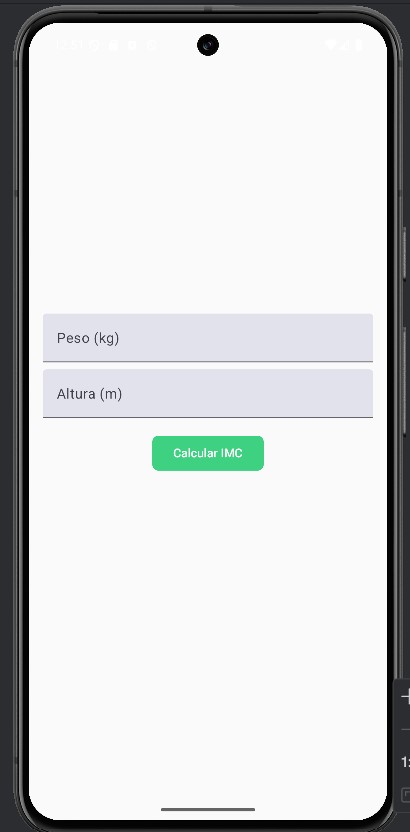
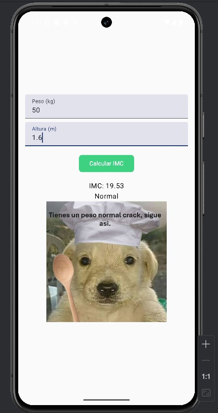
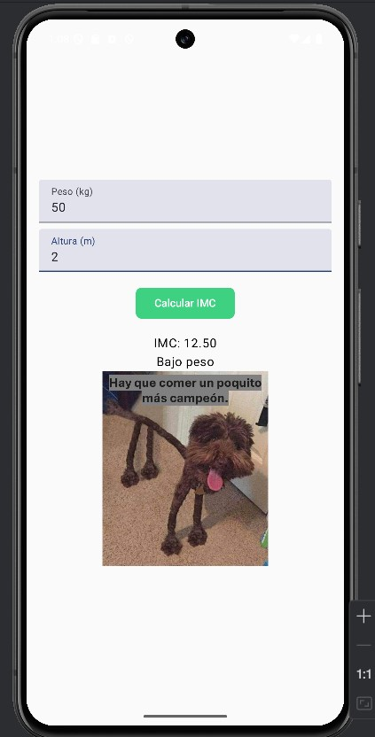
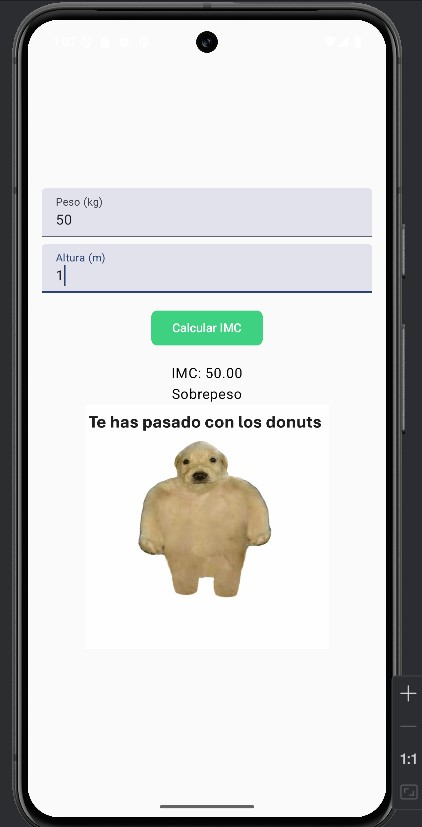

# IMC Marina GS

**IMC** es una aplicación que calcula el índice de masa corporal, para saber si se encuentra en peso normal, bajo de peso o sobrepeso. Desarrollada con **Kotlin** en Android Studio. Contiene una interfaz bastante sencilla dónde hay dos campos de entrada y un botón, el primer campo de entrada es el peso (kg), el segundo la altura (m) y el botón para que haga el cálculo. Depende del resultado saldrá una foto u otra de las tres categorias comentadas antes.

## Características
 Permite ingresar el peso y la altura.  
 Calcula el **IMC** automáticamente con un botón.  
 Muestra la categoría del IMC según el resultado:  
   - 🟢 **Normal**  
   - 🟡 **Bajo peso**  
   - 🔴 **Sobrepeso**  
 Usa **Jetpack Compose** para una interfaz moderna.

## Screenshots

## Estructura
  - MainActivity.kt → La actividad principal que carga la interfaz.
  - IMCLayout.kt → Composable que contiene los inputs y botones.
  - calculateIMC() → Función que calcula el IMC.
  - categorizeIMC() → Función que clasifica el resultado.

## Pruebas unitarias
El proyecto incluye pruebas unitarias para validar los cálculos del IMC.

Para ejecutar las pruebas, usa: ./gradlew test

O desde Android Studio:

Ve a ExampleUnitTest.kt
Haz clic derecho y selecciona Run 'ExampleUnitTest'

## Que he utilizado

  - Jetpack Compose - UI moderna de Android.
  - Kotlin - Lenguaje principal de desarrollo.
  - JUnit - Framework de pruebas unitarias.

## Author
**Marina Gutiérrez Sánchez**

**Email:** malunigss@gmail.com

**Github:** Malunigs

